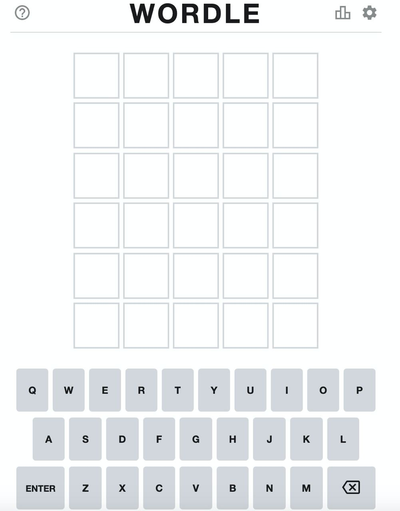
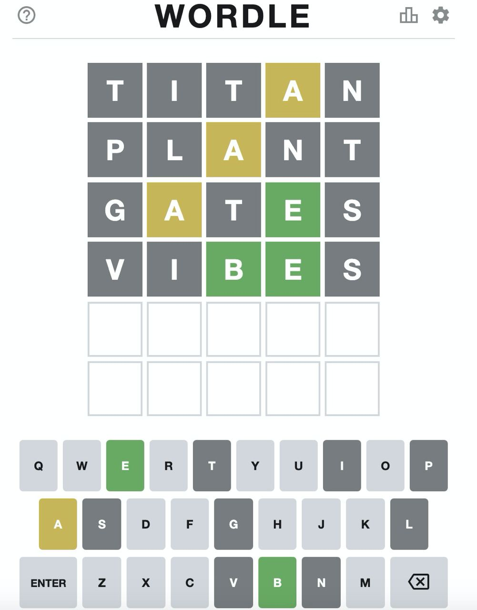

```{r setup, include = FALSE}
# Ajuste comunes de los chunk
knitr::opts_chunk$set(fig.width = 10, fig.asp = 1,
                      out.width = "100%",
                      message = FALSE, warning = FALSE,
                      echo = TRUE, res = 500, retina = 1,
                      dev = "ragg_png")
library(DT)
library(ggtext)
# install.packages("devtools")
# devtools::install_github("gadenbuie/tweetrmd")
library(tweetrmd)

# Para añadir fuentes tipográficas
library(showtext)
font_add_google(family = "Be Vietnam", name = "Be Vietnam")
font_add_google(family = "Roboto", name = "Roboto")
showtext_auto()
```


# Wordle: el juego de moda

> 00:01 (hora local). Aterrizaje efectuado sin dificultad. Propulsión convencial (ampliada). Velocidad de aterrizaje: 6:30 de la escala convencional (restringida). Velocidad en el momento del amaraje: 4 de la escala Bajo-U 109 de la escala Molina-Calvo. Cubicaje: AZ-0.3. Denominación local del lugar de aterrizaje: Sardanyola.

Así empieza uno de mis libros favoritos, **«Sin noticias de Gurb»**, en el que Eduardo Mendoza nos contaba la **historia de un extraterrestre recién aterrizado en Barcelona**, con el objetivo de encontrar a un compañero perdido. Y es que si tuviéramos que elaborar un método en estas primeras semanas de 2022 para detectar si una persona acaba de llegar del espacio exterior, no habría uno mejor que preguntarle: **«¿has jugado a [WORDLE](https://www.powerlanguage.co.uk/wordle/)?»**

```{r echo = FALSE, out.width = "40%", fig.align = "center", fig.cap = "Wordle, el juego de moda: <https://www.powerlanguage.co.uk/wordle/>"}

```
Este sencillo [juego](https://www.powerlanguage.co.uk/wordle/), que imita la dinámica del famoso _Master Mind_, no tiene muchas reglas pero es «adictivo»: **una palabra, 5 letras, y 6 intentos para adivinar** el vocablo mientras la aplicación te indica en cada paso que letras están bien colocadas (o mal colocadas o si directamente no aparecen en la palabra). No solo choca su sencillez sino que además es una **web distinta a las que hoy nos tiene acostumbrados la red**: sin pop-ups, sin anuncios, sin cookies, sin vídeos que se reproducen solos. Nada. Solo un juego, una interfaz sencilla (pero visualmente atractiva) que no reporta ningún beneficio a su creador, el ingenierio de software **Josh Wardle**. Un juego que, aunque ha alcanzado la categoría de fenómeno de masas a finales de 2021 y principios de 2022, **nació además de una historia de amor**, como relata el autor al periodista del New York Times [Daniel Victor](https://twitter.com/bydanielvictor) en esta [entrevista](https://www.nytimes.com/2022/01/03/technology/wordle-word-game-creator.html)<https://www.nytimes.com/2022/01/03/technology/wordle-word-game-creator.html>

Por si alguien llega a esta entrada sin conocer el juego, lo explicamos. El **objetivo consiste en adivinar una palabra de 5 letras**.

```{r echo = FALSE, out.width = "40%", fig.align = "center", fig.cap = "Wordle, el juego de moda: <https://www.powerlanguage.co.uk/wordle/>"}

```

En cada intento el juego nos indica con **amarillo** las letras que están en la palabra (pero mal colocadas), en **verde** las letras que están en la palabra y correctamente colocadas, y en **gris** las letras que no están en la palabra. Con esas pistas, el usuario tiene 6 intentos y solo podrá jugar una palabra al día (quizás esa sea una de las claves de las ganas de seguir jugando).

```{r echo = FALSE, out.width = "40%", fig.align = "center", fig.cap = "Wordle, el juego de moda: <https://www.powerlanguage.co.uk/wordle/>"}

```

Desde unas semanas el juego también cuenta con su versión en castellano, <https://wordle.danielfrg.com/>, adaptado por [Daniel Rodríguez](https://twitter.com/danielfrg), y su versión en catalán, <https://gelozp.com/games/wordle/>, adaptada por [Gerard López](https://twitter.com/gelozp), y no han sido pocos los medios que han dedicado sus espacios a hablar de él.

* **Artículo de Xataka de la versión en castellano**: <https://www.xataka.com/videojuegos/habla-daniel-rodriguez-creador-wordle-espanol-asi-adapto-dos-tardes-juego-online-moda>

* **Entrevista a Gerard López**: <https://www.xataka.com/videojuegos/habla-daniel-rodriguez-creador-wordle-espanol-asi-adapto-dos-tardes-juego-online-moda>

Incluso no son pocos los matemáticos y estadísticos que se han lanzado a intentar analizar el juego, las opciones de ganar y la forma en la que juegan sus usuarios. Es el caso de [Esteban Moro](https://elpais.com/tecnologia/2022-01-12/la-estrategia-de-un-investigador-espanol-para-ganar-al-wordle-el-99-de-las-veces.html?utm_source=Twitter&ssm=TW_CM#Echobox=1641975837), a quién entrevistaban hace unos días en El País contando su estrategia para el juego en inglés, el caso del investigador y divulgador [Picanúmeros](https://www.elconfidencial.com/tecnologia/2022-01-13/matematicas-wordle-juego-estadistica_3357239/) o yo mismo.

```{r echo = FALSE}
tweet_embed("https://twitter.com/Picanumeros/status/1480261322545709063")
```

* **La estrategia de un investigador español para ganar el 99% de las veces al Wordle, el juego de moda en internet**: <https://elpais.com/tecnologia/2022-01-12/la-estrategia-de-un-investigador-espanol-para-ganar-al-wordle-el-99-de-las-veces.html?utm_source=Twitter&ssm=TW_CM#Echobox=1641975837>

* **Las matemáticas detrás del fenómeno Wordle para ganar antes que nadie**: <https://www.elconfidencial.com/tecnologia/2022-01-13/matematicas-wordle-juego-estadistica_3357239/>


# El castellano y sus letras

> Todo lo contenido en este documento está libremente disponible en GitHub <https://github.com/dadosdelaplace/blog-R>

<mark>**Paquetes de `R` que vamos a necesitar**</mark>

* `{tidyverse}`: tratamiento y procesamiento de datos.
* `{skimr}`: resúmenes numéricos
* `{purrr}`: tratamiento de listas
* `{glue}`: concatenación de cadenas de texto.

Además para la creación de este tutorial he usado `{rmarkdown}` con el paquete `{distill}`, el paquete `{tweetrmd}` para incrustar enlaces de Twitter, el paquete `{DT}` para las tablas interactivas y `{ggtext}` para fuentes en las gráficas. Si quieres **empezar a programar en `R` desde cero** tienes por [aquí](https://dadosdelaplace.github.io/courses) materiales gratuitos <https://dadosdelaplace.github.io/courses>

```{r librerias}
library(tidyverse)
library(skimr)
library(purrr)
library(glue)
```

## CREA (Corpus de Referencia del Español Actual)

Dado que se trata de un juego de **adivinar palabras en castellano**, lo primero que vamos a hacer es analizar (de forma muy de «andar por casa») cómo se comportan las palabras y letras en el castellano, así que necesitamos es un **conjunto de palabras** con las que trabajar. 

Seguramente se pueda **scrappear la web oficial** del juego,  en castellano <https://wordle.danielfrg.com/>, pero ando escaso de tiempo así que no he podido extraer el **historial de palabras** que se han jugado hasta ahora (si alguien se anima, todo suyo/a).

Extraer un **listado de palabras de la RAE** tampoco es sencillo ya que la propia institución no lo pone fácil, hasta el **absurdo que su listado de palabras y definiciones** no son de uso libre y tiene copyright, como ha comentado en varias ocasiones [Jaime Gómez Obregón](https://twitter.com/JaimeObregon/status/128478327509822259)

```{r echo = FALSE}
tweet_embed("https://twitter.com/JaimeObregon/status/1284783275098222597")
```

Dichos impedimentos hacen **incluso difícil saber el número de palabras totales** en castellano que la [RAE](https://www.rae.es/) incluye en el diccionario. Según la propia institución:

> «Es imposible saber el número de palabras de una lengua. La última edición del diccionario académico (2014), registraba 93 111 artículos y 195 439 acepciones

```{r echo = FALSE}
tweet_embed("https://twitter.com/raeinforma/status/1088104147612774403?lang=es")
```

Lo que si pone la [RAE](https://www.rae.es/) a nuestra disposición es el [**Corpus de Referencia del Español Actual (CREA)**](https://www.rae.es/banco-de-datos/crea/crea-escrito). El [**CREA**](https://corpus.rae.es/lfrecuencias.html) es un «**conjunto de textos** de diversa procedencia, almacenados en soporte informático, del que es posible extraer información para estudiar las palabras, sus significados y sus contextos». El **corpus de referencia** de la RAE cuenta con **152 560 documentos analizados**, producidos en los países de habla hispana **desde 1975 hasta 2004** (sesgo de selección, parte I), y seleccionados tanto de libros como de periódicos y revistas (sesgo de selección, parte II), y lo tienes en bruto en mi [repositorio](https://raw.githubusercontent.com/dadosdelaplace/blog-R-repo/main/wordle/CREA_bruto.txt). Para su lectura podemos usar `read_delim()` del paquete `stringr` (cargado en el entorno `{tidyverse}`).

```{r eval = FALSE}
# Corpus de Referencia del Español Actual (CREA)
# https://corpus.rae.es/lfrecuencias.html
datos_brutos_CREA <- # read
  read_delim(file = "./CREA_bruto.txt", delim = "\t")
```

## Preprocesado

Dicho fichero lo he **preprocesado** para hacer más fácil su lectura. El archivo preprocesado lo tienes disponible en [CREA_procesado.csv](https://raw.githubusercontent.com/dadosdelaplace/blog-R-repo/main/wordle/CREA_procesado.csv) y el código que he ejecutado lo tienes debajo.

<details>
  <summary>📝<strong>Código</strong></summary>
  
```{r datos-brutos-CREA, eval = FALSE}
# Eliminamos columna de orden y separamos última columna en dos
datos_CREA <-
  datos_brutos_CREA[, -1] %>%
  separate(col = 2, sep = "\t",
           into = c("frec_abs", "frec_norm"))

# Renombramos columnas
names(datos_CREA) <- c("palabra", "frec_abs", "frec_norm")

# Convertimos a número que vienen como cadenas de texto
datos_CREA <- datos_CREA %>%
  mutate(frec_abs = as.numeric(gsub(",", "", frec_abs)),
         frec_norm = as.numeric(frec_norm))

# convertimos tildes
datos_CREA <-
  datos_CREA %>%
  mutate(palabra = gsub(" ", "", iconv(palabra, "latin1")))
```
</details>

&nbsp;

La carga desde el archivo ya preprocesado puede hacerse con `read_csv()`.

```{r CREA-procesado-csv}
# Archivo ya preprocesado
datos_CREA <- read_csv(file = "./CREA_procesado.csv")
```

Tras cargarlo, dado que en el juego en castellano **no se admiten tildes**, pero si la letra `ñ`, he decidido **eliminar todas las tildes, acentos y diéresis del CREA** y he **eliminado duplicados** (por ejemplo, `mi` y `mí` tras quitar tildes). Tienes debajo en **📝Código** un resumen numérico y el código `R`.

<details>
  <summary>📝<strong>Código</strong></summary>
```{r CREA-tildes}
# Quitamos tildes pero no queremos eliminar la ñ
datos_CREA <- datos_CREA %>%
  mutate(palabra =
           gsub("ö", "o",
                gsub("ä", "a",
                     gsub("ò", "o",
                          gsub("ï", "i",
                               gsub("ô", "o",
                                    gsub("â", "a",
                                         gsub("ë", "e",
                                              gsub("ê", "e",
                                                   gsub("ã", "a",
                                                        gsub("î", "i",
                                                             gsub("ù", "u",
                                                                  gsub("¢", "c",
                                                                       gsub("ì", "i",
                                                                            gsub("è", "e",
                                                                                 gsub("à", "a", gsub("ç", "c",
           gsub("á", "a",
                gsub("é", "e",
                     gsub("í", "i",
                          gsub("ó", "o",
                               gsub("ú", "u",
                                    gsub("ü", "u",
                                         as.character(palabra)))))))))))))))))))))))) %>%
  # eliminamos duplicados
  distinct(palabra, .keep_all = TRUE) %>%
  # Eliminamos palabras con '
  filter(!grepl("'", palabra) & !grepl("ø", palabra))

datos_CREA %>% skim()
```
</details>

Tras este preprocesamiento nuestro corpus se compone aproximadamente de **700 000 palabras/vocablos**, de las que tenemos su **frecuencia absoluta** `frec_abs` **(nº de documentos analizados en los que aparece)** y **frecuencia normalizada** `frec_norm` **(veces que aparece por cada 1000 documentos)**.

```{r}
datos_CREA
```

Además, he **calculado los siguientes parámetros** de cada una de las palabras (tienes el código colapsado debajo) por si nos son de utilidad:

* `frec_rel`: la **frecuencia relativa** (proporción de palabras).
* `log_frec_abs`: el **logaritmo de las frecuencias absolutas**.
* `log_frec_rel`: la **frecuencia relativa** de `log_frec_abs`.
* `int_frec_norm`: una variable intervalo para categorizar las palabras en función de las veces que se repiten.
* `nletras`: **número de letras** de cada palabra.

<details>
  <summary>📝<strong>Código</strong></summary>

```{r stats-CREA}
datos_CREA <- datos_CREA %>%
  mutate(# frec. relativa
         frec_relativa = frec_abs / sum(frec_abs),
         # log(frec. absolutas)
         log_frec_abs = log(frec_abs), 
         # log(frec. normalizadas)
         log_frec_rel = log_frec_abs / sum(log_frec_abs),
         # distribución de frec_norm
         int_frec_norm =
           cut(frec_norm,
               breaks = c(-Inf, 0.01, 0.05, 0.1, 0.5, 1:5,
                          10, 20, 40, 60, 80, Inf)),
         # número de letras
         nletras = nchar(palabra))
```
</details>

## Análisis numérico

**¿Cómo se distribuyen las frecuencias de las palabras?** Si nos fijamos en cómo se reparten las palabras y sus repeticiones a lo largo de los más de 150 000 documentos analizados, obtenemos que el 75% de los vocablos que contiene CREA aparecen, como mucho, en 5 de cada 100 000 documentos.

```{r}
quantile(datos_CREA$frec_norm)
datos_CREA %>% skim()
```

Es importante advertir que el **CREA contiene aproximadamente 8 veces más vocablos que palabras hay registradas en la RAE** (según la propia RAE). A diferencia de un diccionario, en CREA **no solo hay palabras registradas oficialmente** en castellano sino que recopila todo un conjunto de vocablos que aparecen en textos, que no siempre tienen porque estar «validadas» en los diccionarios, incluidos americanismos). Por ello, vamos a hacer un filtro inicial, **eliminando aquellas palabras muy poco frecuentes**, definiendo como **poco frecuente toda aquella palabra** que aparezca con una **frecuencia inferior a 1 de cada 1000 textos** analizados o más (aproximadamente 45 000 vocablos).


<details>
  <summary>📝<strong>Código</strong></summary>

```{r}
datos_CREA_filtrado <- datos_CREA %>% filter(frec_norm >= 1)
datos_CREA_filtrado
```
</details>

Tras dicho filtrado, he hecho una **tabla con las 10 000 palabras más repetidas** en frecuencia absoluta, y la **tabla con las 500 palabras menos repetidas** (pero que aparecen en 1 de cada 1000 documentos analizados, o más), por si quieres curiosear algunas de ellas **escribiendo en el buscador**.
 
<mark>**Palabras más repetidas en CREA (las 12 000 primeras)**</mark>

```{r echo = FALSE}
datatable(datos_CREA_filtrado %>%
            arrange(desc(frec_abs)) %>%
            select(c(palabra, frec_abs, frec_relativa,
                     frec_norm,
                     log_frec_abs, log_frec_rel, nletras)) %>%
            slice_head(n = 12000),
          colnames = c("palabras", "frec. absoluta",
                       "frec_relativa",
                       "frec. normalizada", "log-frec",
                       "log-frec relativa",
                       "nº letras"),
          caption = "Palabras más repetidas en CREA",
          options = list(pageLength = 25))  %>%
  formatRound(c("frec_relativa", "log_frec_abs", "log_frec_rel"), digits = 3)
```

<mark>**Palabras menos repetidas en CREA**</mark>

```{r echo = FALSE}
datatable(datos_CREA_filtrado %>%
            arrange(frec_abs) %>%
            select(c(palabra, frec_abs, frec_relativa,
                     frec_norm, log_frec_abs, log_frec_rel,
                     nletras)) %>%
            slice_head(n = 500),
          colnames = c("palabras", "frec. absoluta",
                       "frec. relativa",
                       "frec. normalizada", "log-frec",
                       "log-frec relativa",
                       "nº letras"),
          caption = "Palabras menos repetidas en CREA (de las que aparecen en más de 1 de cada 1000 documentos)",
          options = list(pageLength = 15)) %>%
  formatRound(c("frec_relativa", "log_frec_abs", "log_frec_rel"), digits = 3)
```

Entre todas esas palabras que hemos obtenido quizás sea también relevante **analizar la distribución de las letras**: ¿de qué número de letras son las palabras más repetidas en castellano (según el corpus de la RAE)?

<mark>**Frecuencia de repetición de las palabras según número de letras**</mark>

```{r echo = FALSE}
datatable(datos_CREA_filtrado %>%
            group_by(nletras) %>%
            summarise(frec_media_abs = mean(frec_abs),
                      frec_media_norm = mean(frec_norm)),
          colnames = c("nº de letras", "media frec. abs.",
                       "media frec. norm."),
          caption = "Media de las frecuencias en CREA por número de letras") %>%
  formatRound(c("frec_media_abs", "frec_media_norm"), digits = 3)
```

<mark>**Número de palabras en CREA según número de letras**</mark>

```{r echo = FALSE}
datatable(datos_CREA_filtrado %>%
            group_by(nletras) %>% count() %>%
            ungroup() %>%
            mutate(porc = n / sum(n)),
          colnames = c("nº de letras", "nº de palabras",
                       "frec. relativa (%)"),
          caption = "Nº de palabras por número de letras") %>%
  formatRound(c("porc"), digits = 3) %>%
  formatPercentage(c("porc"))
```

Si combinamos la tabla y los gráficos tenemos:

* La frecuencia de las palabras se reduce según aumenta el número de letras: **las palabras más repetidas tienen menos letras** (menos puntos pero más grande en el gráfico).

* Aunque cada una individualmente se repita menos veces, globalmente, son las **palabras de 7, 8 y 9 letras** las que más aparecen.


```{r echo = FALSE}
theme_set(theme_void())
theme_set(theme_minimal(base_size = 35, base_family = "Roboto"))

theme_update(
  text = element_text(color = "#787c7e"),
  axis.title = element_text(family = "Be Vietnam", size = 45,
                            color = "#787c7e"),
  axis.text.x = element_text(family = "Roboto", size = 23),
  axis.text.y = element_text(family = "Roboto", size = 23),
  panel.grid.major.y = element_blank(),
  panel.grid.minor = element_blank(),
  plot.title = element_text(family = "Be Vietnam", size = 140,
                            color = "black"),
  plot.subtitle = element_text(family = "Roboto", size = 41, lineheight = 0.5),
  plot.caption =
    element_text(family = "Roboto", color = "#6baa64",
                 face = "bold", size = 33)
)

# Marcamos las de 5 palabras
datos_CREA_filtrado <-
  datos_CREA_filtrado %>%
  mutate(candidata_wordle = nletras == 5)

# Número de palabras del CREA
n_palabras_CREA <- nrow(datos_CREA_filtrado)

ggplot(datos_CREA_filtrado,
       aes(x = nletras, fill = candidata_wordle)) +
  geom_bar(alpha = 0.9) +
  scale_fill_manual(values = c("#c9b458", "#6baa64"),
                     labels = c("5 letras", "Otras")) +
  guides(fill = FALSE) +
  labs(y = glue("Número de palabras (totales: {n_palabras_CREA})"),
       x = "Número de letras",
       title = "WORDLE",
       subtitle =
       paste0("Distribución del nº letras en castellano. Se han eliminado las que\n",
              "aparecen en menos de 1 de cada 1000 documentos (CREA)"),
       caption =
         paste0("Javier Álvarez Liébana (@dadosdelaplace) | Datos: CREA"))
```

```{r echo = FALSE}
ggplot(datos_CREA_filtrado,
       aes(x = nletras, y = frec_norm, color = frec_norm, size = frec_norm)) +
  geom_point(alpha = 0.8) + guides(color = FALSE, size = FALSE) +
  labs(y = "Frec. normalizada (por cada 1000 documentos)",
       x = "Número de letras",
       title = "WORDLE",
       subtitle = "Distribución del nº letras vs frecuencia normalizada de CREA",
       caption =
         paste0("Javier Álvarez Liébana (@dadosdelaplace) | Datos: CREA"))
```


<details>
  <summary>📝<strong>Código</strong></summary>

```{r eval = FALSE}
theme_set(theme_void())
theme_set(theme_minimal(base_size = 35, base_family = "Roboto"))

theme_update(
  text = element_text(color = "#787c7e"),
  axis.title = element_text(family = "Be Vietnam", size = 45,
                            color = "#787c7e"),
  axis.text.x = element_text(family = "Roboto", size = 23),
  axis.text.y = element_text(family = "Roboto", size = 23),
  panel.grid.major.y = element_blank(),
  panel.grid.minor = element_blank(),
  plot.title = element_text(family = "Be Vietnam", size = 140,
                            color = "black"),
  plot.subtitle = element_text(family = "Roboto", size = 41, lineheight = 0.5),
  plot.caption =
    element_text(family = "Roboto", color = "#6baa64",
                 face = "bold", size = 33)
)

# Marcamos las de 5 palabras
datos_CREA_filtrado <-
  datos_CREA_filtrado %>%
  mutate(candidata_wordle = nletras == 5)

# Número de palabras del CREA
n_palabras_CREA <- nrow(datos_CREA_filtrado)

ggplot(datos_CREA_filtrado,
       aes(x = nletras, fill = candidata_wordle)) +
  geom_bar(alpha = 0.9) +
  scale_fill_manual(values = c("#c9b458", "#6baa64"),
                     labels = c("5 letras", "Otras")) +
  guides(fill = "none") +
  labs(y = glue("Frec. absoluta ({n_palabras_CREA} palabras)"),
       x = "Número de letras",
       title = "WORDLE",
       subtitle =
       paste0("Distribución del nº letras de CREA. Se han eliminado las que\n",
              "aparecen en menos de 1 de cada 1000 (152 560 docs analizados)"),
       caption =
         paste0("Javier Álvarez Liébana (@dadosdelaplace) | Datos: CREA"))

ggplot(datos_CREA_filtrado,
       aes(x = nletras, y = frec_norm, color = frec_norm, size = frec_norm)) +
  geom_point(alpha = 0.8) + guides(color = "none", size = "none") +
  labs(y = "Frec. normalizada (por cada 1000 documentos)",
       x = "Número de letras",
       title = "WORDLE",
       subtitle = "Distribución del nº letras vs frecuencia normalizada de CREA",
       caption =
         paste0("Javier Álvarez Liébana (@dadosdelaplace) | Datos: CREA"))
```
</details>


## Corpus WORDLE

En los datos anteriores se han incluido **todas las palabras del CREA** que superan cierto número de repeticiones en los documentos (al menos aparecer en 1 de cada 1000 documentos), y vemos como de **5 letras tan solo contamos con casi 4000 palabras** (daría para jugar 10 años seguidos aproximadamente, aunque recuerda que **NO significa que haya esa cantidad de palabras en la RAE**, simplemente estamos analizando las palabras usadas de un conjunto amplío de textos), que representa aproximadamente el 9% de nuestro corpus.

El **juego WORDLE se reduce a palabras de 5 letras**: ¿cuáles son las palabras más repetidas en CREA de dicho tamaño? 


<mark>**Frecuencia de repetición en CREA de las palabras de 5 letras**</mark>


```{r echo = FALSE}
datatable(datos_CREA_filtrado %>% filter(nletras == 5) %>%
            arrange(desc(frec_abs)) %>%
            select(c(palabra, frec_abs, frec_norm,
                     frec_relativa)) %>%
            slice_head(n = 1000),
          caption = "Palabras más repetidas en CREA de 5 letras",
          colnames = c("palabra", "frec. absoluta",
                       "frec. normalizada", "frec. relativa"),
          options = list(pageLength = 15)) %>%
  formatRound(c("frec_norm", "frec_relativa"), digits = 5)
```

Las **10 palabras de 5 letras más repetidas en CREA** son: sobre, entre, había, hasta, desde, puede, todos, parte, tiene y donde/dónde. El creador del juego, como hemos mencionado anteriormente, dispone de un repositorio abierto en [Github](https://github.com/danielfrg/wordle.es), conteniendo, entre otros archivos, el listado de las **620 palabras** que ha considerado inicialmente para el juego. Dicho listado está ya descargado en [palabras_wordle.csv](https://raw.githubusercontent.com/dadosdelaplace/blog-R-repo/main/wordle/palabras_wordle.csv) **SPOILER**: no mires el archivo si vas a seguir jugando, el objetivo  no es dejar de jugar sino analizar las opciones de ganar.

```{r carga-palabras-wordle}
palabras_wordle <- read_csv(file = "./palabras_wordle.csv")
palabras_wordle
```

Nuestro corpus tiene limitaciones, en particular un **sesgo de selección** ya que analiza textos de un periodo concreto, por lo que palabras más usadas en los últimos años quizás no aparezcan con tanta frecuencia en dichos documentos (como `kefir` o `tesla`), amén de que pueden haber sido incluidas por el autor de la aplicación libremente.

Las **palabras en el WORDLE pero no estén incluidas en el filtro de frecuencia realizado vamos a buscarlas en el corpus original**, e incluiremos dichas palabras con sus frecuencias en nuestros corpus filtrado.

<details>
  <summary>📝<strong>Código</strong></summary>

```{r completar-wordle}
setdiff(palabras_wordle %>% pull(palabra),
        datos_CREA_filtrado %>% filter(nletras == 5) %>%
          pull(palabra))

palabras_ausentes <- 
  setdiff(palabras_wordle %>% pull(palabra),
        datos_CREA_filtrado %>% filter(nletras == 5) %>%
          pull(palabra))

datos_CREA_filtrado <-
  datos_CREA %>%
  filter(palabra %in% (palabras_wordle %>% pull(palabra)) | 
           palabra %in% (datos_CREA_filtrado %>% pull(palabra)))
```

```{r}
datos_CREA_filtrado <-
  datos_CREA_filtrado %>%
  add_row(palabra = "cotar", frec_abs = 10,
          log_frec_abs = log(10), nletras = 5) %>%
  add_row(palabra = "titar", frec_abs = 10,
          log_frec_abs = log(10), nletras = 5) %>%
  add_row(palabra = "kopek", frec_abs = 10,
          log_frec_abs = log(10), nletras = 5)
```
</details>

Con las palabras candidatas en WORDLE podemos también generar su **tabla de frecuencias** en los documentos incluidos en el CREA.

<mark>**Frecuencia en CREA de las palabras configuradas para salir en WORLDE**</mark>

```{r echo = FALSE}
datos_palabras_wordle <-
  datos_CREA_filtrado %>%
  filter(palabra %in% palabras_wordle$palabra) %>%
  arrange(desc(frec_relativa))

datatable(datos_palabras_wordle %>%
            select(c(palabra, frec_abs, frec_norm,
                     frec_relativa, log_frec_rel)),
          caption =
            "Frecuencia en CREA de las palabras configuradas para el WORLDE",
          colnames = c("palabras", "frec. absoluta",
                       "frec. normalizada", "frec.relativa",
                       "log-frec relativa"),
          options = list(pageLength = 15))  %>%
  formatRound(c("frec_norm", "frec_relativa",
                "log_frec_rel"), digits = 5)
```

Las **5 palabras del WORDLE con mayor frecuencia de repetición** en el conjunto de textos que componen el corpus de la RAE son `entre, donde, menos, mundo, forma`.

## Frecuencia de letras en palabras

No solo es importante el **número de veces que se repite una palabra** sino cómo se **distribuyen las letras en esas palabras**: no es lo mismo empezar el juego con una palabra con varias vocales (para obtener información de las mismas) que empezar con una palabra que tiene `z`, `ñ` o `k` (ya que lo más seguro es que te quedes con la misma información que antes de jugar). **¿Cómo se distribuyen las letras en el castellano?** ¿Influye el número de palabras? ¿Y su posición?


<details>
  <summary>📝<strong>Código</strong></summary>

```{r}
# Matriz letras tokenizadas
matriz_letras <- function(corpus, n = 5) {
  
  if (!is.null(n)) {
    
    # Filtramos
    corpus_filtrado <- corpus %>% filter(nletras == n)
  
    # Creamos matriz de letras
    matriz_letras <-
      matrix(unlist(strsplit(corpus_filtrado$palabra, "")),
               ncol = nrow(corpus_filtrado))
    
    # Frecuencia de letras en las palabras de wordle
    frecuencia_letras <-
      as_tibble(as.character(matriz_letras)) %>%
      group_by(value) %>% count() %>%
      ungroup %>%
      mutate(porc = 100 * n / sum(n))
    
  } else {
    
    corpus_filtrado <- corpus
    
    # Creamos matriz de letras
    matriz_letras <- unlist(strsplit(corpus_filtrado$palabra, ""))
    
    # Frecuencia de letras en las palabras de wordle
    frecuencia_letras <-
      as_tibble(as.character(matriz_letras)) %>%
      group_by(value) %>% count() %>%
      ungroup %>%
      mutate(porc = 100 * n / sum(n))
  }
  
  # Output
  return(list("corpus_filtrado" = corpus_filtrado,
              "matriz_letras" = matriz_letras,
              "frecuencia_letras" = frecuencia_letras))
}
tokens <- matriz_letras(datos_CREA_filtrado, n = NULL)
```

</details>


<mark>**Frecuencia de las letras en los vocablos de CREA**</mark>

Las **letras más comunes en CREA** son la `a, e, o, i, r`, y las que menos aparecen son la `k, ñ, w`.

```{r echo = FALSE}
datatable(tokens$frecuencia_letras %>% arrange(desc(n)) %>%
            mutate(porc = porc / 100),
          caption = "Frecuencia de las letras en los vocablos de CREA",
          colnames = c("letra", "nº veces", "porcentaje (%)"),
          options = list(pageLength = 15))  %>%
  formatPercentage(columns = c("porc"), digits = 3)
```

¿Se mantiene esa **distribución de las letras** cuando reducimos el corpus de **CREA a palabras de 5 letras**?


<mark>**Frecuencia de las letras en los vocablos de CREA de 5 caracteres**</mark>

```{r echo = FALSE}
tokens <-
  matriz_letras(datos_CREA_filtrado %>%
                  filter(nletras == 5), n = NULL)
datatable(tokens$frecuencia_letras %>% arrange(desc(n)) %>%
            mutate(porc = porc / 100),
          caption = "Frecuencia de las letras en los vocablos de CREA de 5 letras",
          colnames = c("letra", "nº veces", "porcentaje (%)"),
          options = list(pageLength = 30))  %>%
  formatPercentage(columns = c("porc"), digits = 3)
```

Se mantienen las 5 primeras `a, e, o, r, i`, aunque las letras `i,r` se intercambian posicioens. ¿Se mantiene esa **distribución de las letras** en el **conjunto de candidatas de WORDLE**?


<mark>**Frecuencia de las letras en los vocablos candidatos en WORDLE**</mark>

```{r echo = FALSE}
tokens <- matriz_letras(palabras_wordle, n = NULL)
datatable(tokens$frecuencia_letras %>% arrange(desc(n)) %>%
            mutate(porc = porc / 100),
          caption =
            "Frecuencia de las letras en las palabras de WORDLE",
          colnames = c("letra", "nº veces", "porcentaje (%)"),
          options = list(pageLength = 15))  %>%
  formatPercentage(columns = c("porc"), digits = 3)
```

En el caso de las palabras candidatas del WORDLE el top5 queda como `a, o, r, e, l`. Otra pregunta razonable a hacerse sería si **influye el número de letras en los caracteres** que aparecen. **¿La distribución de letras es similar en palabras de 3, 5 u 8 letras?** Veámoslo gráficamente.

```{r echo = FALSE}
ggplot(tokens$frecuencia_letras %>%
         arrange(desc(porc)) %>% select(c(value, porc)) %>%
         mutate(value = factor(value, levels = value),
                vocal = value %in% c("a", "e", "i", "o", "u")),
       aes(x = value, y = porc, fill = vocal)) + 
  geom_col(alpha = 0.9) +
  scale_fill_manual(values = c("#c9b458", "#6baa64"),
                     labels = c("Consonante", "Vocal")) +
  labs(y = "Frec. relativa (%)", x = "Letras",
       title = "WORDLE", fill = "Tipo",
       subtitle =
       paste0("Distribución de las letras en TODAS las palabras de CREA"),
       caption =
         paste0("Javier Álvarez Liébana (@dadosdelaplace) | Datos: CREA"))
```

```{r echo = FALSE}
tokens <- matriz_letras(datos_CREA_filtrado, n = 3)
ggplot(tokens$frecuencia_letras %>%
         arrange(desc(porc)) %>% select(c(value, porc)) %>%
         mutate(value = factor(value, levels = value),
                vocal = value %in% c("a", "e", "i", "o", "u")),
       aes(x = value, y = porc, fill = vocal)) + 
  geom_col(stat = "identity", alpha = 0.9) +
  scale_fill_manual(values = c("#c9b458", "#6baa64"),
                     labels = c("Consonante", "Vocal")) +
  labs(y = "Frec. relativa (%)", x = "Letras",
       title = "WORDLE", fill = "Tipo",
       subtitle =
       paste0("Distribución de las letras en palabras de 3 letras"),
       caption =
         paste0("Javier Álvarez Liébana (@dadosdelaplace) | Datos: CREA"))
```

```{r echo = FALSE}
tokens <- matriz_letras(datos_CREA_filtrado, n = 5)
ggplot(tokens$frecuencia_letras %>%
         arrange(desc(porc)) %>% select(c(value, porc)) %>%
         mutate(value = factor(value, levels = value),
                vocal = value %in% c("a", "e", "i", "o", "u")),
       aes(x = value, y = porc, fill = vocal)) + 
  geom_col(stat = "identity", alpha = 0.9) +
  scale_fill_manual(values = c("#c9b458", "#6baa64"),
                     labels = c("Consonante", "Vocal")) +
  labs(y = "Frec. relativa (%)", x = "Letras",
       title = "WORDLE", fill = "Tipo",
       subtitle =
       paste0("Distribución de las letras en palabras de 5 letras"),
       caption =
         paste0("Javier Álvarez Liébana (@dadosdelaplace) | Datos: CREA"))
```

```{r echo = FALSE}
tokens <- matriz_letras(datos_CREA_filtrado, n = 8)
ggplot(tokens$frecuencia_letras %>%
         arrange(desc(porc)) %>% select(c(value, porc)) %>%
         mutate(value = factor(value, levels = value),
                vocal = value %in% c("a", "e", "i", "o", "u")),
       aes(x = value, y = porc, fill = vocal)) + 
  geom_col(alpha = 0.9) +
  scale_fill_manual(values = c("#c9b458", "#6baa64"),
                     labels = c("Consonante", "Vocal")) +
  labs(y = "Frec. relativa (%)", x = "Letras",
       title = "WORDLE", fill = "Tipo",
       subtitle =
       paste0("Distribución de las letras en palabras de 8 letras"),
       caption =
         paste0("Javier Álvarez Liébana (@dadosdelaplace) | Datos: CREA"))
```

```{r echo = FALSE}
tokens <- matriz_letras(palabras_wordle, n = NULL)
ggplot(tokens$frecuencia_letras %>%
         arrange(desc(porc)) %>% select(c(value, porc)) %>%
         mutate(value = factor(value, levels = value),
                vocal = value %in% c("a", "e", "i", "o", "u")),
       aes(x = value, y = porc, fill = vocal)) + 
  geom_col(alpha = 0.9) +
  scale_fill_manual(values = c("#c9b458", "#6baa64"),
                     labels = c("Consonante", "Vocal")) +
  labs(y = "Frec. relativa (%)", x = "Letras",
       title = "WORDLE", fill = "Tipo",
       subtitle =
       paste0("Distribución de las letras en las palabras de WORDLE"),
       caption =
         paste0("Javier Álvarez Liébana (@dadosdelaplace).\nDatos: CREA y Github danielfrg/wordle.es"))
```

## Palabras iniciales y finales

[Elena Álvarez Mellado](https://twitter.com/lirondos), experta en lingüística computacional, apuntaba que quizás una **pista o ayuda para adivinar las palabras** sea analizar qué letras suelen encabezar y terminas las palabras en castellano. El tuit es este

```{r echo = FALSE}
tweet_embed("https://twitter.com/lirondos/status/1480875293283954693")
```

Entre las palabras de CREA, analizaremos todas las letras iniciales y finales de las palabras de las que disponemos, y **calcularemos la proporción de veces en las que sucede**.


```{r echo = FALSE}
letras_iniciales <-
  tibble("letras_iniciales" =
           map_chr(strsplit(datos_CREA_filtrado$palabra, ""),
                   function(x) { x[1] })) %>%
  group_by(letras_iniciales) %>% count() %>% ungroup() %>%
  mutate(porc = 100 * n / sum(n))

letras_finales <-
  tibble("letras_finales" =
           map_chr(strsplit(datos_CREA_filtrado$palabra, ""),
                   function(x) { rev(x)[1] })) %>%
  group_by(letras_finales) %>% count() %>% ungroup() %>%
  mutate(porc = 100 * n / sum(n))

fig1 <- ggplot(letras_iniciales %>%
         arrange(desc(porc)) %>%
         mutate(letras_iniciales =
                  factor(letras_iniciales, levels = letras_iniciales),
                vocal = 
                  letras_iniciales %in% c("a", "e", "i", "o", "u")),
       aes(x = letras_iniciales, y = porc, fill = vocal)) + 
  geom_col(alpha = 0.9) +
  scale_fill_manual(values = c("#c9b458", "#6baa64"),
                     labels = c("Consonante", "Vocal")) +
  labs(x = "Letras iniciales", y = "Frec. relativa (%)",
       fill = "Tipo")

fig2 <- ggplot(letras_finales %>%
         arrange(desc(porc)) %>%
         mutate(letras_finales =
                  factor(letras_finales, levels = letras_finales),
                vocal =
                  letras_finales %in% c("a", "e", "i", "o", "u")),
       aes(x = letras_finales, y = porc, fill = vocal)) +
  geom_col(alpha = 0.9) +
  scale_fill_manual(values = c("#c9b458", "#6baa64"),
                     labels = c("Consonante", "Vocal")) +
  labs(x = "Letras finales", y = "Frec. relativa (%)",
       fill = "Tipo")

library(patchwork)
(fig1 / fig2) +
  plot_annotation(
    title = "WORDLE",
       subtitle =
       paste0("Distribución de letras finales/iniciales en TODAS las palabras de CREA"),
       caption =
         paste0("Javier Álvarez Liébana (@dadosdelaplace). Datos: CREA")) +
  plot_layout(guides = "collect")
```

Del **conjunto total de CREA**, las **letras más frecuentes iniciando** palabras son `c,a,p,e,d`, y las **letras más frecuentes terminando** palabras son `s,a,o,e,n`.

```{r echo = FALSE}
letras_iniciales <-
  tibble("letras_iniciales" =
           map_chr(strsplit(datos_CREA_filtrado %>%
                              filter(nletras == 5) %>%
                              pull(palabra), ""),
                   function(x) { x[1] })) %>%
  group_by(letras_iniciales) %>% count() %>% ungroup() %>%
  mutate(porc = 100 * n / sum(n))
letras_finales <-
  tibble("letras_finales" =
           map_chr(strsplit(datos_CREA_filtrado %>%
                              filter(nletras == 5) %>%
                              pull(palabra), ""),
                   function(x) { rev(x)[1] })) %>%
  group_by(letras_finales) %>% count() %>% ungroup() %>%
  mutate(porc = 100 * n / sum(n))

fig1 <- 
  ggplot(letras_iniciales %>%
         arrange(desc(porc)) %>%
         mutate(letras_iniciales =
                  factor(letras_iniciales, levels = letras_iniciales),
                vocal = 
                  letras_iniciales %in% c("a", "e", "i", "o", "u")),
       aes(x = letras_iniciales, y = porc, fill = vocal)) + 
  geom_col(alpha = 0.9) +
  scale_fill_manual(values = c("#c9b458", "#6baa64"),
                     labels = c("Consonante", "Vocal")) +
  labs(y = "Frec. relativa (%)", x = "Letras iniciales",
       fill = "Tipo")
fig2 <- 
  ggplot(letras_finales %>%
         arrange(desc(porc)) %>%
         mutate(letras_finales =
                  factor(letras_finales, levels = letras_finales),
                vocal = 
                  letras_finales %in% c("a", "e", "i", "o", "u")),
       aes(x = letras_finales, y = porc, fill = vocal)) + 
  geom_col(alpha = 0.9) +
  scale_fill_manual(values = c("#c9b458", "#6baa64"),
                     labels = c("Consonante", "Vocal")) +
  labs(y = "Frec. relativa (%)", x = "Letras finales",
       fill = "Tipo")

library(patchwork)
(fig1 / fig2) +
  plot_annotation(
    title = "WORDLE",
       subtitle =
       paste0("Distribución de letras finales/iniciales en las palabras de CREA de 5 letras"),
       caption =
         paste0("Javier Álvarez Liébana (@dadosdelaplace). Datos: CREA")) +
  plot_layout(guides = "collect")
```


Del **conjunto total de CREA** con solo 5 letras, las **letras más frecuentes iniciando** palabras son `c,a,p,m,s`, y las **letras más frecuentes terminando** palabras son `a,s,o,e,n`.

```{r echo = FALSE}
letras_iniciales <-
  tibble("letras_iniciales" =
           map_chr(strsplit(palabras_wordle$palabra, ""),
                   function(x) { x[1] })) %>%
           group_by(letras_iniciales) %>% count() %>%
           ungroup() %>%
           mutate(porc = 100 * n / sum(n))
letras_finales <-
  tibble("letras_finales" =
           map_chr(strsplit(palabras_wordle$palabra, ""),
                   function(x) { rev(x)[1] })) %>%
           group_by(letras_finales) %>% count() %>%
           ungroup() %>%
           mutate(porc = 100 * n / sum(n))

fig1 <- 
  ggplot(letras_iniciales %>%
         arrange(desc(porc)) %>%
         mutate(letras_iniciales =
                  factor(letras_iniciales, levels = letras_iniciales),
                vocal = 
                  letras_iniciales %in% c("a", "e", "i", "o", "u")),
       aes(x = letras_iniciales, y = porc, fill = vocal)) + 
  geom_col(alpha = 0.9) +
  scale_fill_manual(values = c("#c9b458", "#6baa64"),
                     labels = c("Consonante", "Vocal")) +
  labs(y = "Frec. relativa (%)", x = "Letras iniciales",
       fill = "Tipo")
fig2 <- 
  ggplot(letras_finales %>%
         arrange(desc(porc)) %>%
         mutate(letras_finales =
                  factor(letras_finales, levels = letras_finales),
                vocal = 
                  letras_finales %in% c("a", "e", "i", "o", "u")),
       aes(x = letras_finales, y = porc, fill = vocal)) + 
  geom_col(alpha = 0.9) +
  scale_fill_manual(values = c("#c9b458", "#6baa64"),
                     labels = c("Consonante", "Vocal")) +
  labs(y = "Frec. relativa (%)", x = "Letras finales",
       fill = "Tipo")

(fig1 / fig2) +
  plot_annotation(
    title = "WORDLE",
       subtitle =
       paste0("Distribución de letras finales/iniciales en las palabras de WORDLE"),
       caption =
         paste0("Javier Álvarez Liébana (@dadosdelaplace). Datos: CREA y github.com/danielfrg")) +
  plot_layout(guides = "collect")
```

Del **conjunto de palabras de WORDLE** las **letras más frecuentes iniciando** palabras son `c,a,m,p,l`, y las **letras más frecuentes terminando** palabras son `o,a,r,e,l`.

<details>
  <summary>📝<strong>Código</strong></summary>

```{r eval = FALSE}
letras_iniciales <-
  tibble("letras_iniciales" =
           map_chr(strsplit(datos_CREA_filtrado$palabra, ""),
                   function(x) { x[1] })) %>%
  group_by(letras_iniciales) %>% count() %>% ungroup() %>%
  mutate(porc = 100 * n / sum(n))

letras_finales <-
  tibble("letras_finales" =
           map_chr(strsplit(datos_CREA_filtrado$palabra, ""),
                   function(x) { rev(x)[1] })) %>%
  group_by(letras_finales) %>% count() %>% ungroup() %>%
  mutate(porc = 100 * n / sum(n))

fig1 <- ggplot(letras_iniciales %>%
         arrange(desc(porc)) %>%
         mutate(letras_iniciales =
                  factor(letras_iniciales, levels = letras_iniciales),
                vocal = 
                  letras_iniciales %in% c("a", "e", "i", "o", "u")),
       aes(x = letras_iniciales, y = porc, fill = vocal)) + 
  geom_col(alpha = 0.9) +
  scale_fill_manual(values = c("#c9b458", "#6baa64"),
                     labels = c("Consonante", "Vocal")) +
  labs(x = "Letras iniciales", y = "Frec. relativa (%)",
       fill = "Tipo")

fig2 <- ggplot(letras_finales %>%
         arrange(desc(porc)) %>%
         mutate(letras_finales =
                  factor(letras_finales, levels = letras_finales),
                vocal =
                  letras_finales %in% c("a", "e", "i", "o", "u")),
       aes(x = letras_finales, y = porc, fill = vocal)) +
  geom_col(alpha = 0.9) +
  scale_fill_manual(values = c("#c9b458", "#6baa64"),
                     labels = c("Consonante", "Vocal")) +
  labs(x = "Letras finales", y = "Frec. relativa (%)",
       fill = "Tipo")

library(patchwork)
(fig1 / fig2) +
  plot_annotation(
    title = "WORDLE",
       subtitle =
       paste0("Distribución de letras finales/iniciales en TODAS las palabras de CREA"),
       caption =
         paste0("Javier Álvarez Liébana (@dadosdelaplace). Datos: CREA")) +
  plot_layout(guides = "collect")
```

```{r eval = FALSE}
letras_iniciales <-
  tibble("letras_iniciales" =
           map_chr(strsplit(datos_CREA_filtrado %>%
                              filter(nletras == 5) %>%
                              pull(palabra), ""),
                   function(x) { x[1] })) %>%
  group_by(letras_iniciales) %>% count() %>% ungroup() %>%
  mutate(porc = 100 * n / sum(n))
letras_finales <-
  tibble("letras_finales" =
           map_chr(strsplit(datos_CREA_filtrado %>%
                              filter(nletras == 5) %>%
                              pull(palabra), ""),
                   function(x) { rev(x)[1] })) %>%
  group_by(letras_finales) %>% count() %>% ungroup() %>%
  mutate(porc = 100 * n / sum(n))

fig1 <- 
  ggplot(letras_iniciales %>%
         arrange(desc(porc)) %>%
         mutate(letras_iniciales =
                  factor(letras_iniciales, levels = letras_iniciales),
                vocal = 
                  letras_iniciales %in% c("a", "e", "i", "o", "u")),
       aes(x = letras_iniciales, y = porc, fill = vocal)) + 
  geom_col(alpha = 0.9) +
  scale_fill_manual(values = c("#c9b458", "#6baa64"),
                     labels = c("Consonante", "Vocal")) +
  labs(y = "Frec. relativa (%)", x = "Letras iniciales",
       fill = "Tipo")
fig2 <- 
  ggplot(letras_finales %>%
         arrange(desc(porc)) %>%
         mutate(letras_finales =
                  factor(letras_finales, levels = letras_finales),
                vocal = 
                  letras_finales %in% c("a", "e", "i", "o", "u")),
       aes(x = letras_finales, y = porc, fill = vocal)) + 
  geom_col(alpha = 0.9) +
  scale_fill_manual(values = c("#c9b458", "#6baa64"),
                     labels = c("Consonante", "Vocal")) +
  labs(y = "Frec. relativa (%)", x = "Letras finales",
       fill = "Tipo")

library(patchwork)
(fig1 / fig2) +
  plot_annotation(
    title = "WORDLE",
       subtitle =
       paste0("Distribución de letras finales/iniciales en las palabras de CREA de 5 letras"),
       caption =
         paste0("Javier Álvarez Liébana (@dadosdelaplace). Datos: CREA")) +
  plot_layout(guides = "collect")
```

```{r eval = FALSE}
letras_iniciales <-
  tibble("letras_iniciales" =
           map_chr(strsplit(palabras_wordle$palabra, ""),
                   function(x) { x[1] })) %>%
           group_by(letras_iniciales) %>% count() %>%
           ungroup() %>%
           mutate(porc = 100 * n / sum(n))
letras_finales <-
  tibble("letras_finales" =
           map_chr(strsplit(palabras_wordle$palabra, ""),
                   function(x) { rev(x)[1] })) %>%
           group_by(letras_finales) %>% count() %>%
           ungroup() %>%
           mutate(porc = 100 * n / sum(n))

fig1 <- 
  ggplot(letras_iniciales %>%
         arrange(desc(porc)) %>%
         mutate(letras_iniciales =
                  factor(letras_iniciales, levels = letras_iniciales),
                vocal = 
                  letras_iniciales %in% c("a", "e", "i", "o", "u")),
       aes(x = letras_iniciales, y = porc, fill = vocal)) + 
  geom_col(alpha = 0.9) +
  scale_fill_manual(values = c("#c9b458", "#6baa64"),
                     labels = c("Consonante", "Vocal")) +
  labs(y = "Frec. relativa (%)", x = "Letras iniciales",
       fill = "Tipo")
fig2 <- 
  ggplot(letras_finales %>%
         arrange(desc(porc)) %>%
         mutate(letras_finales =
                  factor(letras_finales, levels = letras_finales),
                vocal = 
                  letras_finales %in% c("a", "e", "i", "o", "u")),
       aes(x = letras_finales, y = porc, fill = vocal)) + 
  geom_col(alpha = 0.9) +
  scale_fill_manual(values = c("#c9b458", "#6baa64"),
                     labels = c("Consonante", "Vocal")) +
  labs(y = "Frec. relativa (%)", x = "Letras finales",
       fill = "Tipo")

(fig1 / fig2) +
  plot_annotation(
    title = "WORDLE",
       subtitle =
       paste0("Distribución de letras finales/iniciales en las palabras de WORDLE"),
       caption =
         paste0("Javier Álvarez Liébana (@dadosdelaplace). Datos: CREA y github.com/danielfrg")) +
  plot_layout(guides = "collect")
```
</details>


# Puntuando

## Puntuando letras

Hemos visto cuáles son las **letras más frecuentes en las palabras, en general, y al inicio y final de las mismas**, y su probabilidad (empírica) de aparecer. Sin embargo, como bien apunta [Gabriel Rodríguez Alberich](https://twitter.com/Vibragiel), hemos visto que **no todas las palabras aparecerán con la misma frecuencia**, tendremos una bolsa de palabras donde hay palabras más repetidas que otras, así que una opción es **ponderar cada letra por las opciones que tiene cada palabra que la contiene de aparecer**: la letra `e` en `kefir` no debería puntuar lo mismo que en `sobre`. Extraeremos cada letra pero a la hora de contarla, la multiplicaremos por las opciones que tiene la palabra de aparecer.

<details>
  <summary>📝<strong>Código</strong></summary>

```{r}
puntuar_letras <- function(corpus, n = 5) {
  
  if (!is.null(n)) {
    
    # Filtramos
    corpus_filtrado <- corpus %>% filter(nletras == n)
  
    # Creamos matriz de letras
    matriz_letras <-
      matrix(unlist(strsplit(corpus_filtrado$palabra, "")),
               ncol = nrow(corpus_filtrado))
    pesos <- rep(corpus_filtrado$frec_relativa, each = n)
    matriz_letras_pesos <-
      tibble("matriz_letras" = 
               unlist(strsplit(corpus_filtrado$palabra, "")),
             pesos)
    
    # Ponderación de letras
    frecuencia_letras <-
      matriz_letras_pesos %>%
      group_by(matriz_letras) %>%
      summarise(peso_promediado = sum(pesos, na.rm = TRUE)) %>%
      ungroup() %>%
      mutate(peso_promediado_rel =
               peso_promediado / sum(peso_promediado, na.rm = TRUE))
    
  } else {
    
    corpus_filtrado <- corpus
    
    # Creamos matriz de letras
    matriz_letras <- unlist(strsplit(corpus_filtrado$palabra, ""))
    pesos <-
      unlist(mapply(corpus_filtrado$frec_relativa,
                    corpus_filtrado$nletras,
                    FUN = function(x, y) { rep(x, y)}))
    matriz_letras_pesos <- tibble(matriz_letras, pesos)
    
    # Ponderación de letras
    frecuencia_letras <-
      matriz_letras_pesos %>%
      group_by(matriz_letras) %>%
      summarise(peso_promediado = sum(pesos, na.rm = TRUE)) %>%
      ungroup() %>%
      mutate(peso_promediado_rel =
               peso_promediado /
               sum(peso_promediado, na.rm = TRUE))
  }
  
  # Output
  return(frecuencia_letras)
}
puntuacion_letras_global <-
  puntuar_letras(datos_CREA_filtrado, n = NULL)
puntuacion_letras_5 <-
  puntuar_letras(datos_CREA_filtrado, n = 5)
```
</details>

<mark>**Ponderación de las letras basadas en CREA**</mark>


```{r echo = FALSE}
datatable(puntuacion_letras_global %>%
            arrange(desc(peso_promediado_rel)),
          colnames = c("palabras", "peso promediado",
                       "peso relativo"),
          caption = "Ponderación de letras basadas en CREA",
          options = list(pageLength = 10))  %>%
  formatRound(c("peso_promediado", "peso_promediado_rel"),
              digits = 5)
```

<mark>**Ponderación de las letras basadas en palabras de 5 letras de CREA**</mark>

```{r echo = FALSE}
datatable(puntuacion_letras_5 %>%
            arrange(desc(peso_promediado_rel)),
          colnames = c("palabras", "peso promediado",
                       "peso relativo"),
          caption = "Ponderación de letras basadas en CREA (solo palabras de 5 letras)",
          options = list(pageLength = 10)) %>%
  formatRound(c("peso_promediado", "peso_promediado_rel"),
              digits = 5)
``` 


## Puntuando palabras

Una vez que **tenemos puntuadas las letras** que van a formar nuestas palabras vamos a tomar los dos conjuntos de palabras de 5 letras, el **conjunto extraído de CREA** tras eliminar palabras poco repetidas (casi 10 000 vocablos) y el **conjunto de candidatas a WORDLE** (620 palabras), y **puntuaremos cada palabra** en función de cuatro criterios:

* **Peso de letras**: puntuaremos cada palabra **sumando las ponderaciones** de cada letra que la forma (al tener todas 5 letras, es irrelevante usar la suma o la media en el orden final).

* **Letras iniciales y finales**: además de las letras en general, la puntuación obtenida en el paso anterior será **ponderada en función de las probabilidades de que su letra inicial/final** sea, efectivamente, letra inicial/final de una palabra, usando las frecuencias relativas que hemos obtenido antes.

* **Heterogeneidad**: para medir no solo la «calidad» de las letras sino su **diversidad** (a mayor variedad de letras podemos obtener más información de nuestra palabra a adivinar), la puntuación salida de los pasos anteriores será ponderada por un índice de homogeneidad de variables cualitativas conocido como **Índice de Blau (B)**.

$$B = 1 - \sum_{i=1}^{k} f_{i}^{2}$$

donde $k$ es el **número de letras distintas** y $f_i$ es la **proporción de veces** que se repite cada letra distinta en la palabra. Por ejemplo, la palabra `aerea` tendrá un índice de $B = 0.64$ ya que tanto la `a` como la `e` tienen una frecuencia relativa de $2/5$ y la `r` $1/5$, tal que $B = 1 - \left[\left( \frac{2}{5} \right)^2 + \left( \frac{2}{5} \right)^2 + \left( \frac{1}{5} \right)^2 \right] = 0.64$. La máxima puntuación para 5 letras, sería que todas fueran distintas ($k = 5$), con un índice de $B = \frac{k-1}{k} = \frac{4}{5} = 0.8$; la mínima puntuación sería que todas fueran iguales ($k=1$) con $B = 0$. Este índice nos permite **medir la probabilidad de que dos letras de la palabra tomadas al azar sean distintas**. El índice será normalizado para que aquellas palabras con todas las letras repetidas tengan $B_{norm} = 0$ y todas las palabras con las letras distintas tengan $B_{norm} = 1$.

* **Ponderación por la palabra**: la puntuación obtenida en los pasos anteriores es **ponderada finalmente por la «probabilidad» que tiene dicha palabra de ser usada en castellano**, basándonos en las log-frecuencias del CREA.


<details>
  <summary>📝<strong>Código</strong></summary>

```{r}
# Letras iniciales/finales
letras_iniciales <-
  tibble("letras_iniciales" =
           map_chr(strsplit(datos_CREA_filtrado %>%
                              filter(nletras == 5) %>%
                              pull(palabra), ""),
                   function(x) { x[1] })) %>%
  group_by(letras_iniciales) %>% count() %>% ungroup() %>%
  mutate(porc = 100 * n / sum(n))
letras_finales <-
  tibble("letras_finales" =
           map_chr(strsplit(datos_CREA_filtrado %>%
                              filter(nletras == 5) %>%
                              pull(palabra), ""),
                   function(x) { rev(x)[1] })) %>%
  group_by(letras_finales) %>% count() %>% ungroup() %>%
  mutate(porc = 100 * n / sum(n))

# Puntuamos palabras
puntuar_palabras <-
  function(palabras, letras_puntuadas, letras_iniciales,
           letras_finales, nletras = 5) { 
    
    # Matriz letras
    matriz_letras_corpus <- matriz_letras(palabras, n = nletras)
    matriz_letras_corpus <- matriz_letras_corpus$matriz_letras
    
    # palabras	peso promediado	peso relativo
    # Puntuar palabras
    palabras_puntuadas <-
      palabras %>% 
      mutate(punt_letras =
               apply(matriz_letras_corpus, MARGIN = 2,
                     FUN = function(x) { sum(letras_puntuadas$peso_promediado_rel[
                       letras_puntuadas$matriz_letras %in% x] * 
                         c((letras_iniciales %>%
                             filter(letras_iniciales == x[1]) %>%
                              pull(porc)) / 100, 
                           1/5, 1/5, 1/5, (letras_finales %>%
                                       filter(letras_finales ==
                                                rev(x)[1]) %>%
                                       pull(porc)) / 100))}),
             ind_blau =
               apply(matriz_letras_corpus, MARGIN = 2,
                     FUN = function(x) { 1 - sum((table(x) / sum(table(x)))^2)}),
             ind_blau_norm = ind_blau / max(ind_blau),
             punt_letras_total = punt_letras * ind_blau_norm,
             punt_total_w = punt_letras_total * log_frec_abs)
    
    # Iniciales y finales
    
    # Output
    return(list("palabras_puntuadas" = palabras_puntuadas,
                "matriz_letras" = matriz_letras_corpus))
    
  }
CREA_puntuado <-
  puntuar_palabras(datos_CREA_filtrado %>%
                     filter(nletras == 5),
                   puntuacion_letras_5,
                   letras_iniciales, letras_finales)
WORDLE_puntuado <-
  puntuar_palabras(datos_palabras_wordle,
                   puntuacion_letras_5,
                   letras_iniciales, letras_finales)
CREA_puntuado$palabras_puntuadas
WORDLE_puntuado$palabras_puntuadas
```
</details>

<mark>**Puntuación de palabras del CREA**</mark>


```{r echo = FALSE}
datatable(CREA_puntuado$palabras_puntuadas %>%
            select(c(palabra, frec_abs, log_frec_abs,
                     punt_letras, ind_blau, punt_total_w)) %>%
            arrange(desc(punt_total_w)),
          colnames = c("palabras", "frec. abs.", "log-frec abs.",
                       "puntuacion por letras", "Blau",
                       "puntuación total"),
          caption = "Puntuación de palabras del CREA",
          options = list(pageLength = 15))  %>%
  formatRound(c("log_frec_abs", "punt_letras",
                "ind_blau", "punt_total_w"), digits = 5)
```

<mark>**Puntuación de palabras candidatas de WORDLE**</mark>

```{r echo = FALSE}
datatable(WORDLE_puntuado$palabras_puntuadas %>%
            select(c(palabra, frec_abs, log_frec_abs,
                     punt_letras, ind_blau,  punt_total_w)) %>%
            arrange(desc(punt_total_w)),
          colnames = c("palabras", "frec. abs.", "log-frec abs.",
                       "puntuacion por letras", "Blau",
                       "puntuación total"),
          caption = "Puntuación de palabras candidatas de WORDLE",
          options = list(pageLength = 10))  %>%
  formatRound(c("log_frec_abs", "punt_letras",
                "ind_blau", "punt_total_w"), digits = 5)
``` 


# Simulando WORDLE

Una vez que tenemos un sistema para puntuar palabras, la **mecánica será sencilla**: vamos a simular un número de partidas de WORDLE, considerando tres casos:

* **El peor de los casos**. El conjunto de palabras que el usuario podría pensar y el conjunto de palabras a adivinar es el mismo, y es el conjunto extenso de **vocablos de CREA** de 5 letras, con `r nrow(datos_CREA_filtrado %>% filter(nletras == 5))` vocablos.

* **El mejos de los casos**. El conjunto de palabras que el usuario podría pensar y el conjunto de palabras a adivinar es el mismo, y es el conjunto reducido de **palabras que el juego oficial de WORDLE** en castellano tiene programadas, con `r nrow(datos_palabras_wordle)` vocablos.

* **El caso realista**. Aunque el conjunto de palabras a adivinar sea uno concreto y reducido, el usuario podría tener en su cabeza muchas palabras en mente que decidiese probar. En el caso realista, el conjunto de palabras que el usuario podría pensar será el **conjunto de vocablos de CREA** de 5 letras y con una frecuencia normalizada superior a 3 por cada 1000 documentos analizados (un total de `r nrow(datos_CREA_filtrado %>% filter(frec_norm >= 3))` vocablos, bastante más extenso de las palabras que una persona seguramente pueda considerar, de `r nrow(datos_CREA_filtrado %>% filter(frec_norm >= 3 & nletras == 5))` palabras si lo reducimos a las palabras de 5 letras). Sin embargo, el **conjunto de palabras a adivinar** será el conjunto reducido de palabras que el **juego oficial de WORDLE en castellano** tiene programadas, con `r nrow(datos_palabras_wordle)` vocablos.


Una vez tenemos puntuadas las palabras la mecánica será sencilla. Generaremos un **conjunto de simulaciones**, generando una palabra inicial en cada una de ellas (palabra inicial que se obtendrá aleatoriamente tomando las puntuaciones de las palabras como pesos). En cada iteración comprobaremos que letras están bien colocadas, que letras están pero mal colocadas y que letras son errores. Tras dicha comprobación, **calcularemos el conjunto de palabras de entre las candidatas que cumplen dichas condiciones**, y de ese conjunto «superviviente» elegiremos la **palabra con mayor puntuación posible**. Además, para comprobar que nuestro método **mejora la metodología de hacerlo totalmente aleatorio**, se compara en cada caso que pasaría si simplemente eligiéramos las palabras al azar del conjunto de candidatas que cumplen las condiciones.

Aunque el juego en inglés si parece elegir las palabras a jugar en base a su frecuencia de uso en inglés, priorizando las palabras más usadas (aquí una metodología propuesta por [Esteban Moro](https://twitter.com/estebanmoro/status/1480748041460191233) para el juego en inglés), no tengo constancia que sea así en castellano, así que la **elección de palabras a adivinar será equiprobable (todas las palabras tienen las mismas opciones de salir)** y, de momento, la palabra inicial del usuario también.

<details>
  <summary>📝<strong>Código</strong></summary>

```{r}
# Iteración del juego
iteracion <- function(inicial, clave) {
  
  # Jugada
  bien_colocadas <-
    unlist(map2(strsplit(inicial, ""), strsplit(clave, ""),
                function(x, y) { x == y }))
  mal_colocadas <-
    unlist(map2(strsplit(inicial, ""), strsplit(clave, ""),
                function(x, y) { x %in% y })) &
    !bien_colocadas
  errores <- !(bien_colocadas | mal_colocadas)
  
  # Output
  return(list("bien_colocadas" = bien_colocadas,
              "mal_colocadas" = mal_colocadas,
              "errores" = errores))
}

# Simulación
simular_wordle <-
  function(corpus, matriz_corpus, palabras_candidatas = corpus, 
           intentos = 1, generar_equi = TRUE, iniciar_equi = TRUE,
           dummy_random = FALSE,  inicial_fija = NULL,
           clave_fija = NULL,
           extremely_dummmy = FALSE) {
    
    
    if (is.null(clave_fija)) {
      
      # probabilidades de salir la palabra
      # * si generar_equi = TRUE --> equiprobables
      # * si generar_equi = FALSE --> en función de pesos
      if (generar_equi) {
        
        probs_gen <- rep(1 / nrow(palabras_candidatas),
                         nrow(palabras_candidatas))
        
      } else {
        
        probs_gen <- palabras_candidatas$punt_total_w /
          sum(palabras_candidatas$punt_total_w)
        
      }
    
      # Palabra a adivinar
      clave <- sample(palabras_candidatas$palabra,
                      size = 1, prob = probs_gen)
    } else {
      
      clave <- clave_fija
    }
    propiedades_clave <-
      palabras_candidatas %>% filter(palabra == clave)
    
    # Palabra inicial
    if (is.null(inicial_fija)) {
      if (iniciar_equi) {
        
        inicial <- sample(corpus$palabra, size = 1)
        
      } else {
        
        # Las 50 mejor puntuadas
        inicial <- corpus %>%
          arrange(desc(punt_total_w)) %>%
          slice(30) %>% pull(palabra)
        inicial <- sample(inicial, size = 1)
        
      }
    } else {
      
      inicial <- inicial_fija
      
    }
    propiedades_inicial <- corpus %>% filter(palabra == inicial)
    
    # Inicialización
    palabra_0 <- inicial
    candidatas <- corpus
    matriz_candidatas <- matriz_corpus
    salida <- list()
    for (i in 1:intentos) {
      
      salida[[i]] <- iteracion(palabra_0, clave)
      
      idx_palabras <-
        apply(matriz_candidatas, MARGIN = 2,
              FUN = function(x) {
                all(x[salida[[i]]$bien_colocadas] ==
                      unlist(strsplit(palabra_0, ""))[salida[[i]]$bien_colocadas]) }) &
        apply(matriz_candidatas, MARGIN = 2,
              FUN = function(x) {
                all(!(x %in% unlist(strsplit(palabra_0, ""))[salida[[i]]$errores])) })
      
      if (any(salida[[i]]$mal_colocadas)) {
        
        idx_palabras <- idx_palabras &
          apply(matriz_candidatas, MARGIN = 2,
                FUN = function(x) {
                  all(unlist(strsplit(palabra_0, ""))[salida[[i]]$mal_colocadas] %in% x) &
                    all(!mapply(x[which(salida[[i]]$mal_colocadas)],
                                unlist(strsplit(palabra_0, ""))[salida[[i]]$mal_colocadas],
                                FUN = function(x, y) { x == y})) } )
      }
      
      # Seleccionamos
      if (extremely_dummmy) {
        
        matriz_candidatas <- matriz_candidatas
        candidatas <- candidatas
        
      } else {
        if (any(idx_palabras)) {
          
          matriz_candidatas <- matriz_candidatas[, idx_palabras]
          candidatas <- candidatas[idx_palabras, ]
          
          if (!dummy_random) {
            
            palabra_0 <-
              candidatas %>% arrange(desc(punt_total_w)) %>%
              slice(1) %>% pull(palabra)
            
          } else {
            
            palabra_0 <-
              candidatas %>%
              slice_sample(n = 1) %>% pull(palabra)
          }
          
        }
      }
      
      if (nrow(candidatas) <= 1) {
        
        break
      } 
    }
    
    intentos <- ifelse(nrow(candidatas) == 1, i, intentos + 1)
    
    # Output
    return(list("palabra_clave" = clave, "inicial" = inicial,
                "salida" = salida, "candidatas" = candidatas,
                "palabra_0" = palabra_0,
                "matriz_candidatas" = matriz_candidatas,
                "intentos" = intentos,
                "propiedades_clave" = propiedades_clave,
                "propiedades_inicial" = propiedades_inicial))
  }

simulacion_wordle <-
  function(corpus_puntuado,
           palabras_candidatas = corpus_puntuado,
           simulaciones = 1e3, nintentos = 6,
           generar_equi = TRUE, iniciar_equi = TRUE,
           dummy_random = FALSE, inicial_fija = NULL,
           clave_fija = NULL,
           extremely_dummmy = FALSE) {
    
    # Puntuamos palabras
    corpus_wordle_puntuado <- corpus_puntuado$palabras_puntuadas
    matriz_letras_wordle <- corpus_puntuado$matriz_letras
    palabras_candidatas <- palabras_candidatas$palabras_puntuadas
  
    # Simulación
    resultados <- 
      replicate(simulaciones,
                simular_wordle(corpus_wordle_puntuado,
                               matriz_letras_wordle,
                               palabras_candidatas,
                               intentos = nintentos,
                               generar_equi = generar_equi,
                               iniciar_equi = iniciar_equi,
                               dummy_random = dummy_random,
                               inicial_fija = inicial_fija,
                               clave_fija = clave_fija,
                               extremely_dummmy = extremely_dummmy))
    # Output
    return(list("corpus_wordle" = corpus_wordle_puntuado,
                "matriz_letras_wordle" = matriz_letras_wordle,
                "corpus_wordle_puntuado" = corpus_wordle_puntuado,
                "resultados" = resultados))
  }
```
</details>

Empecemos por el peor de los casos: la **palabra a adivinar puede ser cualquiera** de los `r nrow(datos_CREA_filtrado %>% filter(nletras == 5))` **vocablos de CREA** de 5 letras.


<details>
  <summary>📝<strong>Código</strong></summary>

```{r simulacion-1}
# * 6 intentos y 5 letras
# * con palabra inicial y clave equiprobables
simulaciones <- 2000
generar_equi <- TRUE
iniciar_equi <- FALSE
set.seed(1234567)
simulacion_CREA <-
  simulacion_wordle(CREA_puntuado,
                    simulaciones = simulaciones,
                    generar_equi = generar_equi,
                    iniciar_equi = iniciar_equi,
                    dummy_random = FALSE)

intentos_CREA <- unlist(simulacion_CREA$resultados["intentos", ])
distrib_intentos_CREA <- 100 * table(intentos_CREA) / simulaciones
media_intentos_CREA <- mean(intentos_CREA)
distrib_intentos_CREA
media_intentos_CREA

# Dummy (palabra aleatoria entre candidatas)
generar_equi <- TRUE
iniciar_equi <- TRUE
simulacion_dummy <-
  simulacion_wordle(CREA_puntuado,
                    simulaciones = simulaciones,
                    generar_equi = generar_equi,
                    iniciar_equi = iniciar_equi,
                    dummy_random = TRUE)
intentos_dummy <- unlist(simulacion_dummy$resultados["intentos", ])
distrib_intentos_dummy <- 100 * table(intentos_dummy) / simulaciones
media_intentos_dummy <- mean(intentos_dummy)
distrib_intentos_dummy
media_intentos_dummy
```
</details>

```{r tabla-1, echo = FALSE}
caption_tabla <-
  glue("Resultados con vocablos de CREA ({simulaciones} simulaciones)")
tabla_intentos_CREA <- 
  tibble("intentos" = sort(unique(intentos_CREA)),
         "veces" = table(intentos_CREA),
         "frecuencia" = distrib_intentos_CREA /
           sum(distrib_intentos_CREA))
tabla_intentos_dummy <- 
  tibble("intentos" = sort(unique(intentos_dummy)),
         "veces_aleat" = table(intentos_dummy),
         "frecuencia_aleat" = distrib_intentos_dummy /
           sum(distrib_intentos_dummy))
intentos_conjunto <- left_join(tibble("intentos" = 1:7),
                               tabla_intentos_CREA, by = "intentos")
intentos_conjunto <-
  left_join(intentos_conjunto, tabla_intentos_dummy,
            by = "intentos") %>% 
  mutate(across(everything(), ~replace_na(.x, 0)))

df <- # tabla resultados
  intentos_conjunto %>%
  mutate(intentos = ifelse(intentos == 7, "FALLO",
                           as.character(intentos)))

datatable(df,
          rownames = FALSE,
          colnames = c("intentos", "veces", "frecuencia (%)",
                       "veces (aleatorio)",
                       "frecuencia aleatoria (%)"),
          caption = caption_tabla) %>%
  formatPercentage(c("frecuencia", "frecuencia_aleat"),
                   digits = 2) %>%
  formatStyle(names(df[, c(2, 4)]),
              background =
                styleColorBar(range(df[, c(2, 4)]), "#c9b458"),
              backgroundSize = '98% 88%',
              backgroundRepeat = 'no-repeat',
              backgroundPosition = 'center') %>%
  formatStyle("intentos",
              target = 'row',
              backgroundColor = styleEqual(c("FALLO"), c("#F2D1D1")))
```


En este caso extremo en el que nuestras **palabras candidatas podrían ser** los `r nrow(datos_CREA_filtrado %>% filter(nletras == 5))` **vocablos de CREA** de 5 letras, conseguimos **ganar en 6 intentos** o menos el `r round(100 - 100 * (df %>% filter(intentos == "FALLO") %>% pull(frecuencia)), 2)`% de las veces, con una media de `r round(media_intentos_CREA, 2)` intentos para resolverlo y una mediana de `r round(median(intentos_CREA), 2)` (el 50% de las veces lo resuelve en dichos intentos o menos). En el caso de **decidir las palabras aleatoriamente (entre las candidatas en cada paso)**, obtendríamos una media de `r round(media_intentos_dummy, 2)` y una mediana de `r round(median(intentos_dummy), 2)`, consiguiendo resolverlo  el `r round(100 - 100 * (df %>% filter(intentos == "FALLO") %>% pull(frecuencia_aleat)), 2)`% de las veces.

```{r grafica-1, echo = FALSE}
# gráfica
ggplot(df %>% mutate(fallo = (intentos == "FALLO"))) + 
  geom_col(aes(x = intentos, y = frecuencia, fill = fallo),
           alpha = 0.9) +
  scale_fill_manual(values = c("#6baa64", "#E34D4D"),
                     labels = c("Acertado", "Fallo"))  +
  geom_vline(xintercept = median(intentos_CREA), size = 3) +
  labs(y = "Frec. relativa (%)", x = "Intentos",
       title = "WORDLE", fill = "Tipo",
       subtitle =
       paste0("Distribución de intentos en la simulación. Candidatas y clave: palabras de CREA"),
       caption =
         paste0("Javier Álvarez Liébana (@dadosdelaplace) | Datos: CREA"))
```

El mejor de los casos será aquel en el que el conjunto de palabras que el usuario podría pensar y el conjunto de palabras a adivinar es el mismo, y es el conjunto reducido de **palabras que el juego oficial de WORDLE** en castellano tiene programadas, con `r nrow(datos_palabras_wordle)` vocablos.


<details>
  <summary>📝<strong>Código</strong></summary>

```{r simulacion-2}
# solo las candidatas a wordle
simulaciones <- 2000
generar_equi <- TRUE
iniciar_equi <- FALSE
set.seed(1234567)
simulacion_WORDLE <-
  simulacion_wordle(WORDLE_puntuado,
                    simulaciones = simulaciones,
                    generar_equi = generar_equi,
                    iniciar_equi = iniciar_equi)
intentos_WORDLE <- unlist(simulacion_WORDLE$resultados["intentos", ])
distrib_intentos_WORDLE <- 100 * table(intentos_WORDLE) / simulaciones
media_intentos_WORDLE <- mean(intentos_WORDLE)
distrib_intentos_WORDLE
media_intentos_WORDLE

# Dummy (palabra aleatoria entre candidatas)
generar_equi <- TRUE
iniciar_equi <- TRUE
simulacion_dummy_WORDLE <-
  simulacion_wordle(WORDLE_puntuado,
                    simulaciones = simulaciones,
                    generar_equi = generar_equi,
                    iniciar_equi = iniciar_equi,
                    dummy_random = TRUE)
intentos_dummy_WORDLE <-
  unlist(simulacion_dummy_WORDLE$resultados["intentos", ])
distrib_intentos_dummy_WORDLE <-
  100 * table(intentos_dummy_WORDLE) / simulaciones
media_intentos_dummy_WORDLE <- mean(intentos_dummy_WORDLE)
distrib_intentos_dummy_WORDLE
media_intentos_dummy_WORDLE
```
</details> 

```{r tabla-2, echo = FALSE}
caption_tabla <-
  glue("Resultados con vocablos de WORDLE ({simulaciones} simulaciones)")
tabla_intentos_WORDLE <- 
  tibble("intentos" = sort(unique(intentos_WORDLE)),
         "veces" = table(intentos_WORDLE),
         "frecuencia" = distrib_intentos_WORDLE /
           sum(distrib_intentos_WORDLE))
tabla_intentos_dummy_WORDLE <- 
  tibble("intentos" = sort(unique(intentos_dummy_WORDLE)),
         "veces_aleat" = table(intentos_dummy_WORDLE),
         "frecuencia_aleat" = distrib_intentos_dummy_WORDLE /
           sum(distrib_intentos_dummy_WORDLE))
intentos_conjunto_WORDLE <- left_join(tibble("intentos" = 1:7),
                               tabla_intentos_WORDLE, by = "intentos")
intentos_conjunto_WORDLE <-
  left_join(intentos_conjunto_WORDLE, tabla_intentos_dummy_WORDLE,
            by = "intentos") %>% 
  mutate(across(everything(), ~replace_na(.x, 0)))

df_WORDLE <- # tabla resultados
  intentos_conjunto_WORDLE %>%
  mutate(intentos = ifelse(intentos == 7, "FALLO",
                           as.character(intentos)))

datatable(df_WORDLE,
          rownames = FALSE,
          colnames = c("intentos", "veces", "frecuencia (%)",
                       "veces (aleatorio)",
                       "frecuencia aleatoria (%)"),
          caption = caption_tabla) %>%
  formatPercentage(c("frecuencia", "frecuencia_aleat"),
                   digits = 2) %>%
  formatStyle(names(df[, c(2, 4)]),
              background =
                styleColorBar(range(df[, c(2, 4)]), "#c9b458"),
              backgroundSize = '98% 88%',
              backgroundRepeat = 'no-repeat',
              backgroundPosition = 'center') %>%
  formatStyle("intentos",
              target = 'row',
              backgroundColor = styleEqual(c("FALLO"), c("#F2D1D1")))
```

En este caso conseguimos **ganar en 6 intentos** o menos el `r round(100 - 100 * (df_WORDLE %>% filter(intentos == "FALLO") %>% pull(frecuencia)), 2)`% de las veces, con una media de `r round(media_intentos_WORDLE, 2)` intentos para resolverlo y una mediana de `r round(median(intentos_WORDLE), 2)` (el 50% de las veces lo resuelve en dichos intentos o menos). En el caso de **decidir las palabras aleatoriamente (entre las candidatas en cada paso)**, obtendríamos una media de `r round(media_intentos_dummy_WORDLE, 2)` y una mediana de `r round(median(intentos_dummy_WORDLE), 2)` (el 50% de las veces lo resuelve en dichos intentos o menos)., consiguiendo resolverlo el `r round(100 - 100 * (df_WORDLE %>% filter(intentos == "FALLO") %>% pull(frecuencia_aleat)), 2)`% de las veces.


```{r grafica-2, echo = FALSE}
# gráfica
ggplot(df_WORDLE %>% mutate(fallo = (intentos == "FALLO"))) + 
  geom_col(aes(x = intentos, y = frecuencia, fill = fallo),
           alpha = 0.9) +
  scale_fill_manual(values = c("#6baa64", "#E34D4D"),
                     labels = c("Acertado", "Fallo"))  +
  geom_vline(xintercept = median(intentos_WORDLE), size = 3) +
  labs(y = "Frec. relativa (%)", x = "Intentos",
       title = "WORDLE", fill = "Tipo",
       subtitle =
       paste0("Distribución de intentos. Candidatas y clave: palabras WORDLE"),
       caption =
         paste0("Javier Álvarez Liébana (@dadosdelaplace).\nDatos: CREA y Github danielfrg/wordle.es"))
```

Por último el **caso más realista**: el conjunto de palabras que el usuario podría pensar será el **conjunto de vocablos de CREA** de 5 letras y con una frecuencia normalizada superior a 3 por cada 1000 documentos analizados (un total de `r nrow(datos_CREA_filtrado %>% filter(frec_norm >= 3))` vocablos, bastante más extenso de las palabras que una persona seguramente pueda considerar, de `r nrow(datos_CREA_filtrado %>% filter(frec_norm >= 3 & nletras == 5))` palabras si lo reducimos a las palabras de 5 letras). Sin embargo, el **conjunto de palabras a adivinar** será el conjunto reducido de palabras que el **juego oficial de WORDLE en castellano** tiene programadas, con `r nrow(datos_palabras_wordle)` vocablos.

<details>
  <summary>📝<strong>Código</strong></summary>

```{r simulacion-3}
# adivinando wordle pero con corpus
simulaciones <- 2000
generar_equi <- TRUE
iniciar_equi <- FALSE
set.seed(1234567)
simulacion_mixta <-
  simulacion_wordle(CREA_puntuado,
                    palabras_candidatas = WORDLE_puntuado,
                    simulaciones = simulaciones,
                    generar_equi = generar_equi,
                    iniciar_equi = iniciar_equi)
intentos_mixta <- unlist(simulacion_mixta$resultados["intentos", ])
distrib_intentos_mixta <-
  100 * table(intentos_mixta) / simulaciones
media_intentos_mixta <- mean(intentos_mixta)
distrib_intentos_mixta
media_intentos_mixta

# Dummy (palabra aleatoria entre candidatas)
generar_equi <- TRUE
iniciar_equi <- TRUE
simulacion_dummy_mixta <-
  simulacion_wordle(CREA_puntuado,
                    palabras_candidatas = WORDLE_puntuado,
                    simulaciones = simulaciones,
                    generar_equi = generar_equi,
                    iniciar_equi = iniciar_equi,
                    dummy_random = TRUE)
intentos_dummy_mixta <-
  unlist(simulacion_dummy_mixta$resultados["intentos", ])
distrib_intentos_dummy_mixta <-
  100 * table(intentos_dummy_mixta) / simulaciones
media_intentos_dummy_mixta <- mean(intentos_dummy_mixta)
distrib_intentos_dummy_mixta
media_intentos_dummy_mixta
```
</details>

```{r tabla-3, echo = FALSE}
caption_tabla <-
  glue("Resultados con candidatas de CREA pero clave de WORDLE ({simulaciones} simulaciones)")
tabla_intentos_mixta <- 
  tibble("intentos" = sort(unique(intentos_mixta)),
         "veces" = table(intentos_mixta),
         "frecuencia" = distrib_intentos_mixta /
           sum(distrib_intentos_mixta))
tabla_intentos_dummy_mixta <- 
  tibble("intentos" = sort(unique(intentos_dummy_mixta)),
         "veces_aleat" = table(intentos_dummy_mixta),
         "frecuencia_aleat" = distrib_intentos_dummy_mixta /
           sum(distrib_intentos_dummy_mixta))
intentos_conjunto_mixta <- left_join(tibble("intentos" = 1:7),
                               tabla_intentos_mixta, by = "intentos")
intentos_conjunto_mixta <-
  left_join(intentos_conjunto_mixta, tabla_intentos_dummy_mixta,
            by = "intentos") %>% 
  mutate(across(everything(), ~replace_na(.x, 0)))

df_mixta <- # tabla resultados
  intentos_conjunto_mixta %>%
  mutate(intentos = ifelse(intentos == 7, "FALLO",
                           as.character(intentos)))

datatable(df_mixta,
          rownames = FALSE,
          colnames = c("intentos", "veces", "frecuencia (%)",
                       "veces (aleatorio)",
                       "frecuencia aleatoria (%)"),
          caption = caption_tabla) %>%
  formatPercentage(c("frecuencia", "frecuencia_aleat"),
                   digits = 2) %>%
  formatStyle(names(df_mixta[, c(2, 4)]),
              background =
                styleColorBar(range(df_mixta[, c(2, 4)]), "#c9b458"),
              backgroundSize = '98% 88%',
              backgroundRepeat = 'no-repeat',
              backgroundPosition = 'center') %>%
  formatStyle("intentos",
              target = 'row',
              backgroundColor = styleEqual(c("FALLO"), c("#F2D1D1")))
```

En este caso conseguimos **ganar en 6 intentos** o menos el `r round(100 - 100 * (df_mixta %>% filter(intentos == "FALLO") %>% pull(frecuencia)), 2)`% de las veces, con una media de `r round(media_intentos_mixta, 2)` intentos para resolverlo y una mediana de `r round(median(intentos_mixta), 2)` (el 50% de las veces lo resuelve en dichos intentos o menos). En el caso de **decidir las palabras aleatoriamente (entre las candidatas en cada paso)**, obtendríamos una media de `r round(media_intentos_dummy_mixta, 2)` y una mediana de `r round(median(intentos_dummy_mixta), 2)` (el 50% de las veces lo resuelve en dichos intentos o menos), consiguiendo resolverlo el `r round(100 - 100 * (df_mixta %>% filter(intentos == "FALLO") %>% pull(frecuencia_aleat)), 2)`% de las veces.

```{r grafica-3, echo = FALSE}
palabras_iniciales <- 
  unlist(simulacion_mixta$resultados["inicial", ])
palabras_clave <- 
  unlist(simulacion_mixta$resultados["palabra_clave", ])
palabras_iniciales_fallo <- palabras_iniciales[intentos_mixta == 7]
palabras_clave_fallo <- palabras_clave[intentos_mixta == 7]

# gráfica
ggplot(df_mixta %>% mutate(fallo = (intentos == "FALLO"))) + 
  geom_col(aes(x = intentos, y = frecuencia, fill = fallo),
           alpha = 0.9) +
  scale_fill_manual(values = c("#6baa64", "#E34D4D"),
                     labels = c("Acertado", "Fallo"))  +
  geom_vline(xintercept = median(intentos_mixta), size = 3) +
  labs(y = "Frec. relativa (%)", x = "Intentos",
       title = "WORDLE", fill = "Tipo",
       subtitle =
       paste0("Distribución de intentos. Candidatas: CREA. Clave: palabras WORDLE"),
       caption =
         paste0("Javier Álvarez Liébana (@dadosdelaplace).\nDatos: CREA y Github danielfrg/wordle.es"))
```


&nbsp;

Las **palabras a adivinar en los casos en los que no se puedo completar** en 6 menos eran:

`r if (length(palabras_clave_fallo) == 0) { "ninguna" } else { unique(palabras_clave_fallo) }`

Las **palabras iniciales** eran:

`r if (length(palabras_iniciales_fallo) == 0) { "ninguna" } else { unique(palabras_iniciales_fallo) }`

**IMPORTANTE**: los resultados de elegir una palabra aleatoria tienen truco, ya que no es totalmente aleatorio, sino que estamos cribando palabras en función de los resultados de la iteración anterior. Si la palabra fuese totalmente aleatorio, sin atender a los resultados de los cuadrados, el resultado sería bastante desastrosos, pero asumimos que en el peor de los casos, la estrategia mínima de un usuario será, al menos, cuadrar una palabra en función de sus cuadrados anteriores. 


## Elección de la palabra inicial

Por último vamos a realizar una busqueda de las **palabras que mejor funcionan como palabra inicial**. Para ello vamos a considerar las **palabras del CREA más repetidas** (que aparezcan en más de 220 de cada 1000 documentos) amén de las palabras de WORDLE (filtrando las que se repitan en menos de 20 de cada 1000 documentos). Para cada una vamos a generar un **número de simulaciones y contabilizar el número de éxitos o fracasos**.

<details>
  <summary>📝<strong>Código</strong></summary>

```{r eleccion-palabra-inicial}
idx_WORDLE <-
  which(WORDLE_puntuado$palabras_puntuadas$frec_norm > 20)
idx_frec <- which(CREA_puntuado$palabras_puntuadas$frec_norm > 220 &
               CREA_puntuado$palabras_puntuadas$nletras == 5 &
               !(CREA_puntuado$palabras_puntuadas$palabra %in%
                   WORDLE_puntuado$palabras_puntuadas$palabra))

datos_CREA_frecuentes <- WORDLE_puntuado
datos_CREA_frecuentes$palabras_puntuadas <-
  rbind(WORDLE_puntuado$palabras_puntuadas[idx_WORDLE, ],
        CREA_puntuado$palabras_puntuadas[idx_frec, ])
datos_CREA_frecuentes$matriz_letras <-
  cbind(WORDLE_puntuado$matriz_letras[, idx_WORDLE],
        CREA_puntuado$matriz_letras[, idx_frec])

simulaciones <- 400
generar_equi <- TRUE
iniciar_equi <- FALSE
simulacion <- intentos <- distrib_intentos <- list()
media_intentos <- mediana_intentos <- n_fallos <-
  rep(0, nrow(datos_CREA_frecuentes$palabras_puntuadas))
for (i in 1:nrow(datos_CREA_frecuentes$palabras_puntuadas)) {
  
  simulacion[[i]] <-
      simulacion_wordle(datos_CREA_frecuentes,
                        palabras_candidatas = WORDLE_puntuado,
                        simulaciones = simulaciones,
                        generar_equi = generar_equi,
                        iniciar_equi = iniciar_equi,
                        inicial_fija = datos_CREA_frecuentes$palabras_puntuadas$palabra[i],
                        dummy_random = FALSE)
  
    intentos[[i]] <-
      unlist(simulacion[[i]]$resultados["intentos", ])
    distrib_intentos[[i]] <- 100 * table(intentos[[i]]) / simulaciones
    media_intentos[i] <- mean(intentos[[i]])
    mediana_intentos[i] <- median(intentos[[i]])
    n_fallos[i] <- sum(intentos[[i]] == 7)
}
```
</details>

```{r echo = FALSE}
df <- tibble("palabra" = datos_CREA_frecuentes$palabras_puntuadas$palabra,
             "media" = round(media_intentos, 3),
             "mediana" = round(mediana_intentos, 3),
             "fallos" = n_fallos / simulaciones)

caption_tabla <-
  glue("Resultados probando distintas palabras iniciales ({simulaciones} simulaciones)")
datatable(df, rownames = FALSE, caption = caption_tabla,
          colnames = c("palabra", "media", "mediana",
                       "fallos (%)")) %>%
  formatPercentage(c("fallos"), digits = 3)


```

Las **palabras iniciales con mejor «rendimiento»** han sido:

`r df %>% arrange(media) %>% slice_head(n = 7) %>% pull(palabra)`.


# Jugar a WORDLE

Puedes simular el juego con el código en <https://github.com/dadosdelaplace/blog-R-repo/blob/main/wordle/codigoR.R>, con el que podrás introducir los aciertos que te devuelva la web, y la función te propondrá palabras candidatas a introducir.

La idea es hacer en el futuro un simulador visual del juego en `R` pero...to be continued. Aunque puedes simular el juego Tenéis un simulador en `R` para el juego en inglés en <https://github.com/coolbutuseless/wordle>

# 🛑 Limitaciones

## Mi ignorancia

La rama de la estadística o la ciencia de datos que se dedica al análisis de texto se suele conocer como _text mining_ o **minería de textos**, y es una de las ramas más complejas y difíciles (al menos en mi opinión) ya que **perdemos las bondades de los números** y pasamos a trabajar no solo con variables cualitativas (no son variables cuantitativas, no cuantifican ningun valor medible) sino que entra en juego un factor complejo de modelizar: las **reglas del lenguaje**. Al contrario que el famoso Master Mind, donde cada combinación de colores es posible, al trabajar con letras y palabras **no todas las combinaciones son válidas**. Incluso existe toda una rama de la computación, ciencia de datos e inteligencia artficial dedicada a conseguir que un ordenador no solo procese palabras sino que las «entienda», y sea capaz de interactuar con lo escrito (por ejemplo, GPT-3).

La principal limitación de este pequeño análisis es mi **propia ignorancia**: no soy experto en minería de datos ni en **1ºººº2www          procesamiento natural del lenguaje (NLP)**, más allá de un superficial conocimiento para poder impartir docencia en el máster de minería de datos de la UCM. Así que, obviamente, la metodología tiene un mero objetivo pedagógico y lúdico, siendo ampliamente mejorable.

Para aprender de este tipo de herramientas os dejo una **lista de expertas y expertos** que han tratado estos temas por Twitter:

[Julia Silge](https://twitter.com/juliasilge), experta en _text mining_ y autora de muchos de los paquetes más útiles de `R` para el tratamiento de textos.

[Elena Álvarez Mellado](https://twitter.com/lirondos), experta en lingüística computacional, y autora de uno de los repositorios más útiles para aprender a tratar textos, donde recopila los discursos de los jefes de Estado en España desde 1937 hasta 2021 <https://github.com/lirondos/discursos-de-navidad>

[Picanúmeros](https://twitter.com/Picanumeros), doctor en estadística y divulgador, suele analizar los textos de los programas electorales de los partidos en España.

[Barri](https://twitter.com/BarriPdmx) y [Mari Luz Congosto](https://twitter.com/congosto), expertos en análisis de mensajes en Twitter (y su propagación).

[Dot CSV (Carlos Santana)](https://twitter.com/DotCSV), divulgador en Inteligencia Artificial, y uno de los mayores (y mejores) divulgadores de tecnologías como GPT-3.

## Sesgo de selección en el corpus

En los **datos analizados del CREA hay un sesgo de selección** que depende de la tipología de los textos analizados (de hecho términos relacionados con biología o ciencia aparecen en mucha menor frecuencia) y con la franja temporal a la que pertenecen dichos documentos. Es importante recordar que el conjunto de vocablos en CREA no tiene porque coincidir con las palabras registradas en el diccionario oficial de la RAE.

## Hipótesis de léxico extenso

Todo lo simulado se ha realizado bajo la hipótesis de que los usuarios conocen todas las palabras posibles del conjunto de palabras candidatas, algo que seguramente no suceda, por lo que el **éxito en el juego dependará fuertemente del número de palabras** que se sepa la persona que juegue. Algo interesante a analizar sería cómo evolucionan los aciertos en función del número de palabras que uno conoce (y basándonos en las palabras más usadas en castellano).


